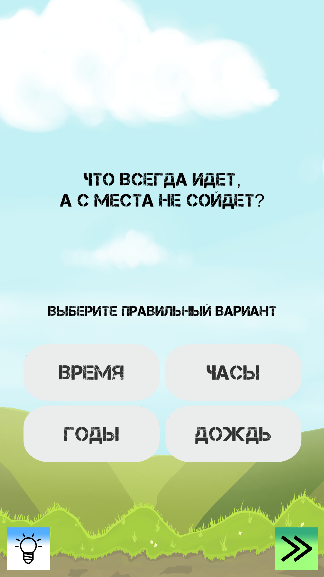

# QuizGame

**QuizGame** — це проста вікторина для мобільних пристроїв. Гравцеві пропонуються питання з кількома варіантами відповідей. Вибір правильної відповіді дозволяє перейти до наступного запитання, 
тоді як неправильна відповідь просто завершує поточний раунд і починає новий.

## Геймплей

- Гравець бачить запитання та 4 варіанти відповідей.  
- Вибір правильної відповіді відкриває нове питання.  
- Три послідовні неправильні відповіді в одному раунді скидають вікторину, починаючи новий раунд.  
- Гра не має завершення — гравець може грати стільки, скільки забажає.  

## Управління

- Вибір відповіді здійснюється натисканням на відповідний варіант.
- Правильна обраний варіант зафарбовує комірку в зелений колір, неправильний - в червоний колір.  
- Гру можна закрити в будь-який момент через системну кнопку телефону.  

## Використані технології

- **Unity** — основний рушій гри.  
- **C#** — для реалізації логіки вікторини.  
- **UI-система Unity** — для створення інтерфейсу запитань та відповідей.  

## Скриншоти

  
  
